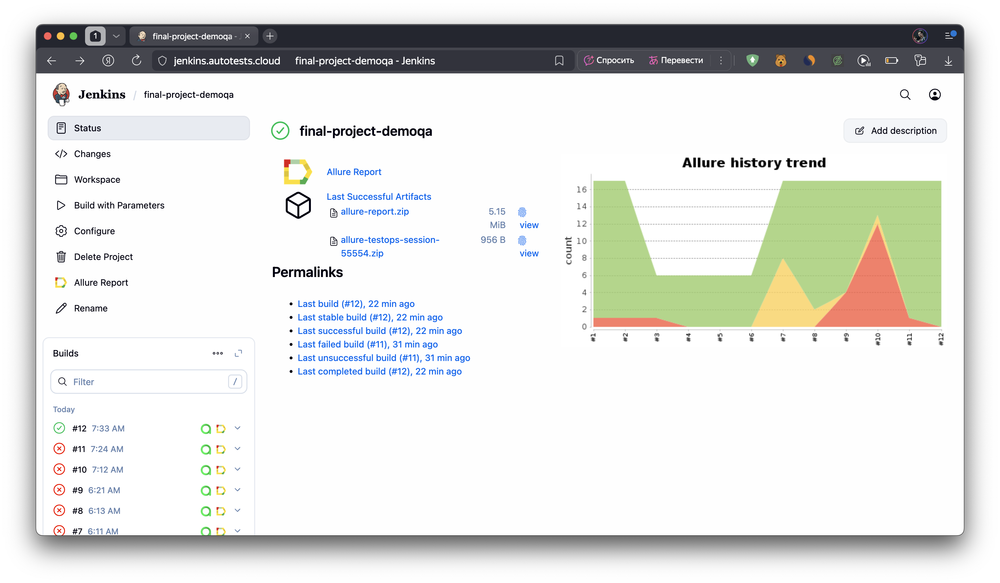
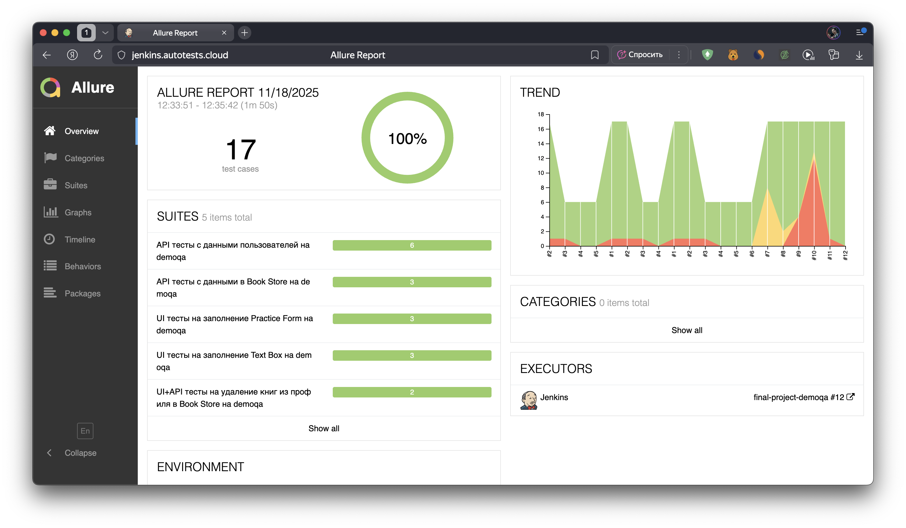
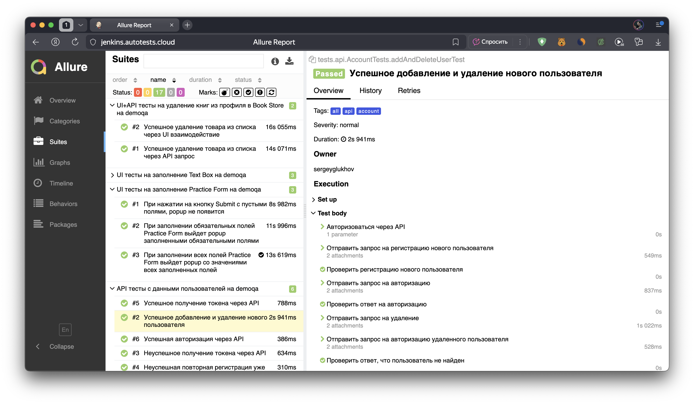
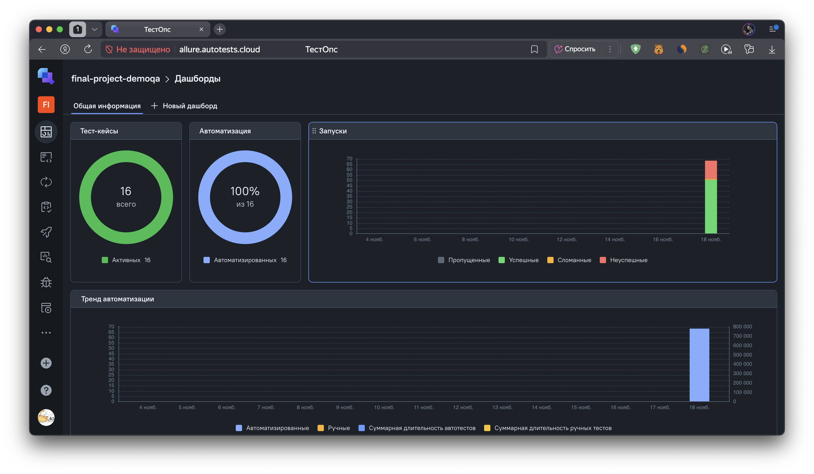
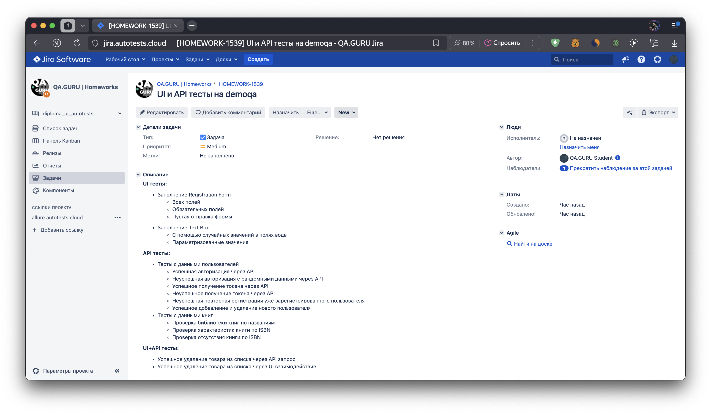
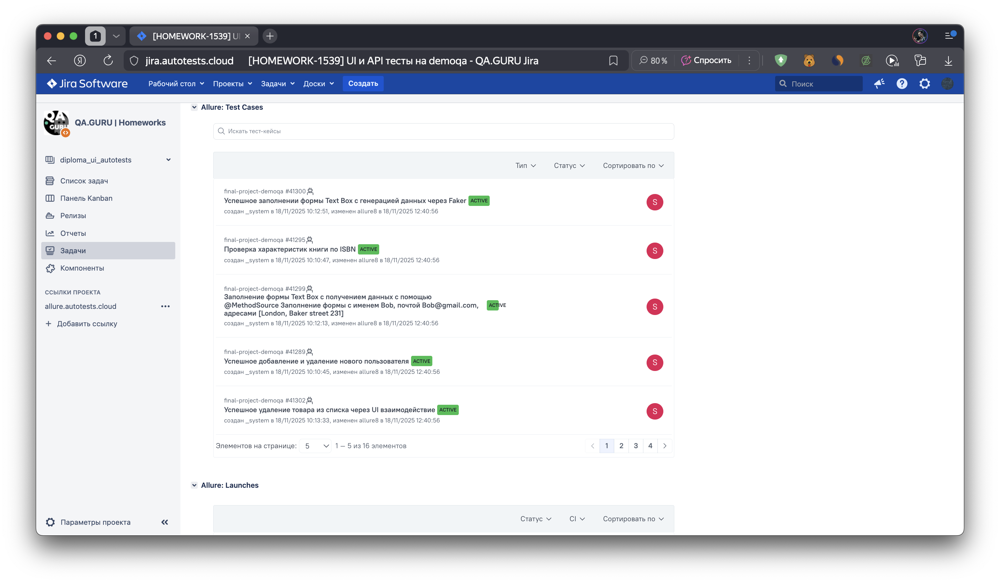
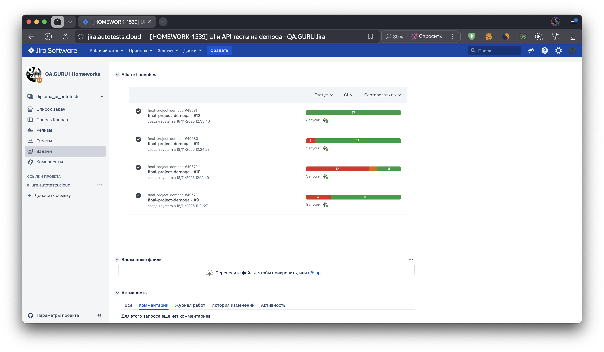
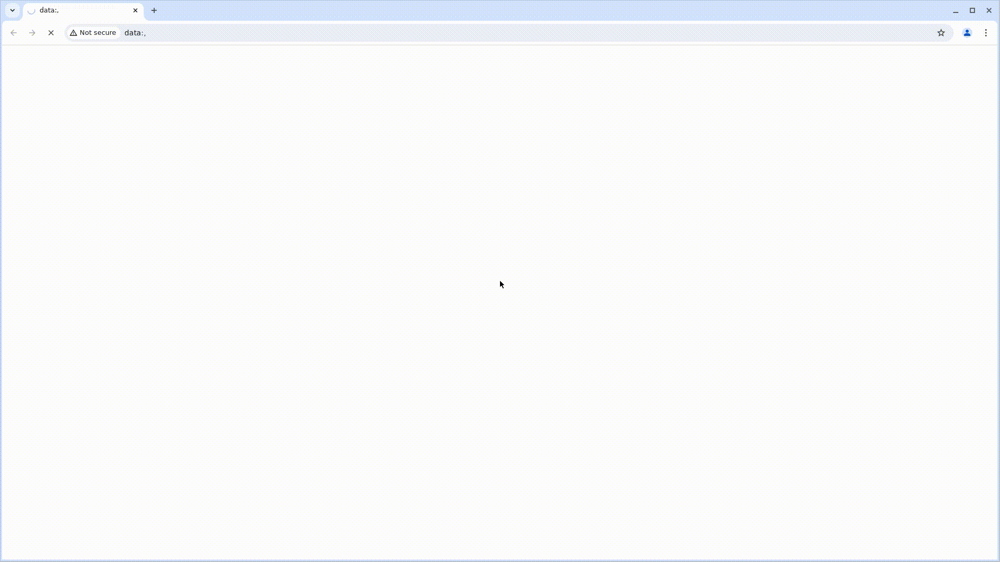
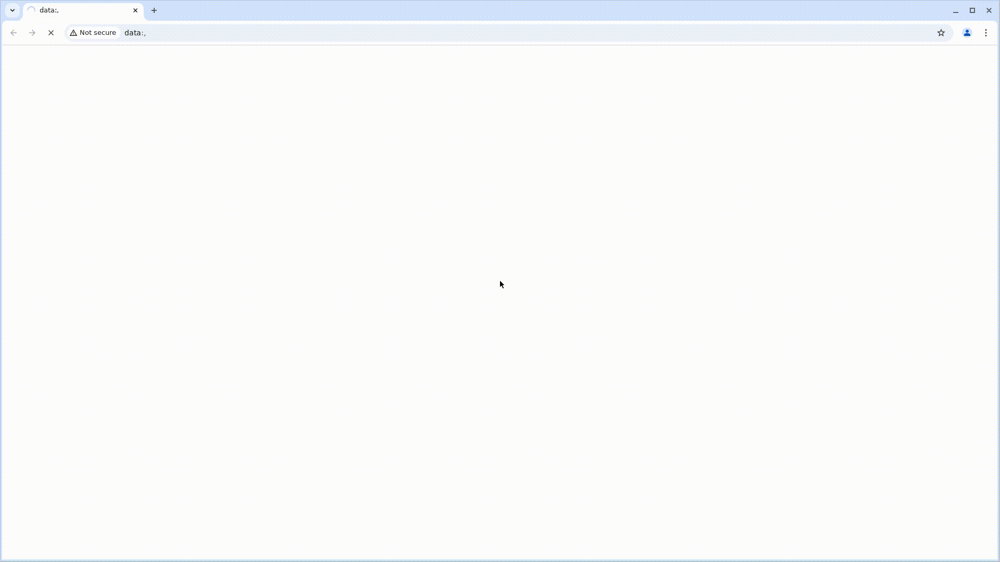

# Проект по автоматизации UI и API тестирования на [demoqa.com](https://demoqa.com/)
<a href="https://demoqa.com/"></a>

## Структура:

- <a href="#-технологии-и-инструменты">Стек</a>
- <a href="#-проведенные автотесты">Проведенные автотесты</a>
- <a href="#-сборка-в-Jenkins">Сборка в Jenkins</a>
- <a href="#-запуск-из-терминала">Запуск из терминала</a>
- <a href="#-allure-отчет">Allure отчет</a>
- <a href="#-интеграция-с-allure-testops">Интеграция с Allure TestOps</a>
- <a href="#-интеграция-с-jira">Интеграция с Jira</a>
- <a href="#-отчет-в-telegram">Отчет в Telegram</a>
- <a href="#-видео-примеры-прохождения-тестов">Видео примеры прохождения тестов</a>

## 🛠️ Стек

<p align="center">


</p>

## ✅ Проведенные автотесты

### UI тесты:

- Заполнение Registration Form
  - Всех полей
  - Обязательных полей
  - Отправка пустой формы
- Заполнение Text Box
  - С помощью случайных значений в полях вода
  - Параметризованные значения

### API тесты:

- Тесты с данными пользователей
  - Успешная авторизация через API
  - Неуспешная авторизация с рандомными данными через API
  - Успешное получение токена через API
  - Неуспешное получение токена через API
  - Неуспешная повторная регистрация уже зарегистрированного пользователя
  - Успешное добавление и удаление нового пользователя  
- Тесты с данными книг
  - Проверка библиотеки книг по названиям
  - Проверка характеристик книги по ISBN
  - Проверка отсутствия книги по ISBN

### UI+API тесты:
- Успешное удаление товара из списка через API запрос
- Успешное удаление товара из списка через UI взаимодействие

## 📋 Сборка в [Jenkins](https://jenkins.autotests.cloud/job/final-project-demoqa/)
<p>

</p>

### Параметры сборки в Jenkins:
Сборка в Jenkins

- env (среда, по умолчанию remote - удаленный запуск на ферме Selenoid)
- task (выбор групп тестов)
- baseUrl (по умолчанию https://demoqa.com)
- browser (браузер, по умолчанию chrome)
- browserVersion (версия браузера, по умолчанию 127)
- browserSize (размер окна браузера, по умолчанию 1920x1080)

## ▶️ Запуск из терминала
Локальный запуск:
```
gradle clean test -Denv=local
```
Удаленный запуск:
```
clean 
${TASK}_test 
-Denv=${ENV}
-DbaseUrl=${BASE_URL}
-Dbrowser=${BROWSER}
-DbrowserVersion=${BROWSER_VERSION}
-DbrowserSize=${BROWSER_SIZE}
-DwebDriverHost=${WEB_DRIVER_HOST}
-DremoteUrl=https://${AUTH}@${WEB_DRIVER_HOST}/wd/hub
```

## 📑 [Allure отчет](https://jenkins.autotests.cloud/job/final-project-demoqa/allure/)

- ### Главный экран отчета
<p>

</p>

- ### Страница с проведенными тестами
<p>

</p>

## 📑 Интеграция с [Allure TestOps](https://allure.autotests.cloud/project/5009/dashboards)

- ### Экран с результатами запуска тестов
<p>

</p>

- ### Страница с тестами в TestOps
<p>

</p>

## 📑 Интеграция с [Jira](https://jira.autotests.cloud/browse/HOMEWORK-1539)

- ### Страница с задачей в Jira (описание, тест-кейсы, запуски)
<p>



</p>

## 💬 Отчет в Telegram
<p>

</p>

## 🎦 Видео примеры прохождения тестов
> К каждому тесту в отчете прилагается видео. Пара таких видео представлено ниже.
<p>
  
  
</p>